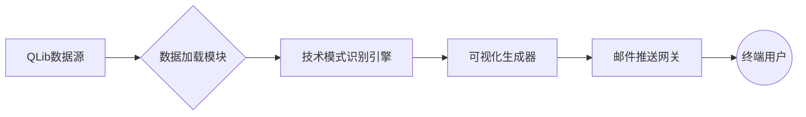

# 基金数据模式分析与自动报告生成系统文档

## 系统概述
本系统是基于QLib金融数据平台构建的自动化分析工具，集成技术模式识别、可视化展示及邮件推送功能，实现基金数据的全流程分析[1,3](@ref)。系统于2025年03月31日开发，主要服务于基金投资决策支持场景。

---

## 核心功能模块

### 1. 数据加载与预处理
- **QLib数据集成**：通过`D.features`接口获取基金开盘价、收盘价等关键指标数据，支持自定义时间范围查询[8](@ref)
- **数据标准化**：
  - 字段重命名（`$open`→`open`）
  - 时间序列索引转换（`pd.to_datetime`）
  - 数据类型强制转换（`astype('float64')`）
- **数据增强**：自动追加预测数据点（最新行情值的0.1%波动模拟）

### 2. 技术模式识别
- **滚动模式分析**：基于`rolling_patterns`函数实现12日窗口期的技术形态识别，支持以下模式检测：
  - 头肩顶/底形态
  - 三角形整理形态
  - 支撑/阻力位识别[6](@ref)
- **动态阈值适应**：根据40日历史数据自动调整识别敏感度

### 3. 可视化报告生成
- **双视图输出**：
  - 概览视图（overview）：展示主要趋势线和关键支撑位
  - 细节视图（detail）：标注具体形态模式及成交量变化[9](@ref)
- **自动化存储**：
  - 按日期创建独立存储目录（示例：`20250331_pattern_graph`）
  - 标准化命名规则（基金代码_日期_视图类型.jpg）

### 4. 邮件自动推送
- **批量发送机制**：
  - 支持多附件打包发送（最多3个图表文件）
  - 收件人列表动态配置（`REPORT_RECIPIENTS`）
- **安全认证**：
  - SMTP_SSL加密传输
  - 授权码隔离存储（从配置文件读取）[10](@ref)
- **内容模板**：
  - 固定正文模板（"请查收附件[...]系统自动发送"）
  - 主题含时间戳标识（示例："20250331_基金分析报告"）

---

## 系统架构特性

### 数据流设计
